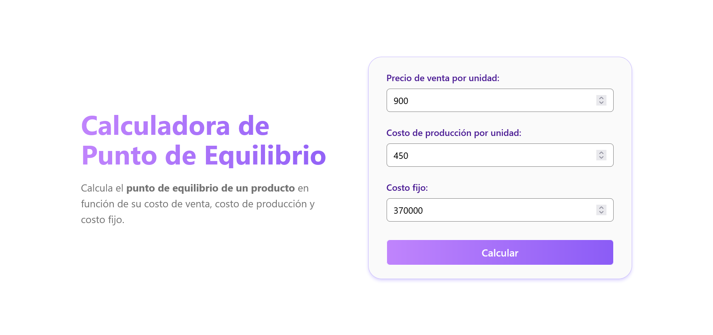

# Calculadora de Punto de Equilibrio

---

Este proyecto es una **calculadora de punto de equilibrio** que permite calcular el punto de equilibrio de un producto en función de su costo de venta, costo de producción y costo fijo.

## Descripción

La **calculadora de punto de equilibrio** es una herramienta que ayuda a los empresarios o emprendedores a determinar cuántas unidades deben vender para cubrir sus costos fijos. A partir de tres valores ingresados:

1. **Precio de venta por unidad**: El precio al que se vende el producto.
2. **Costo de producción por unidad**: El costo de producir una unidad del producto.
3. **Costo fijo**: Los costos fijos que no dependen de la cantidad producida, como renta, sueldos, etc.

La calculadora muestra el número de unidades necesarias para alcanzar el punto de equilibrio, así como el ingreso total correspondiente.

Además, genera un gráfico visualizando los ingresos y costos totales a medida que aumentan las unidades vendidas.

## Características

- Cálculo automático del punto de equilibrio.
- Visualización gráfica de los ingresos y costos a través de un gráfico interactivo.
- Interfaz amigable y responsive.
- Validaciones de entrada para garantizar que los valores sean correctos.

## Tecnologías utilizadas

- **HTML**: Estructura de la página.
- **CSS**: Estilos visuales utilizando TailwindCSS.
- **JavaScript**: Lógica de cálculo y manejo de interactividad.
- **Chart.js**: Librería para generar gráficos interactivos.

## Uso

1. Ingresa los valores para el **precio de venta por unidad**, **costo de producción por unidad** y **costo fijo** en los campos correspondientes.
2. Haz clic en el botón **Calcular**.
3. El resultado mostrará el número de unidades necesarias para alcanzar el punto de equilibrio y el ingreso total.
4. Un gráfico se generará automáticamente, mostrando cómo varían los ingresos y los costos totales en función del número de unidades.

## Contribución

¡Contribuciones son bienvenidas! Si tienes alguna sugerencia o mejora, por favor abre un *issue* o un *pull request*.

## Contacto

Si tienes alguna pregunta o comentario, no dudes en contactarme:

- **Email**: [garaven.camilo@gmail.com](mailto:garaven.camilo@gmail.com)
- **GitHub**: [garaven](https://github.com/garaven)

---

### Licencia

Este proyecto está bajo la licencia MIT. Consulta el archivo [LICENSE](LICENSE) para más detalles.
